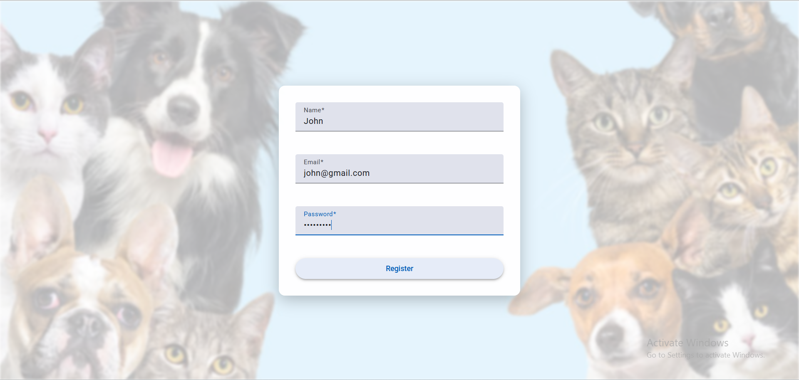
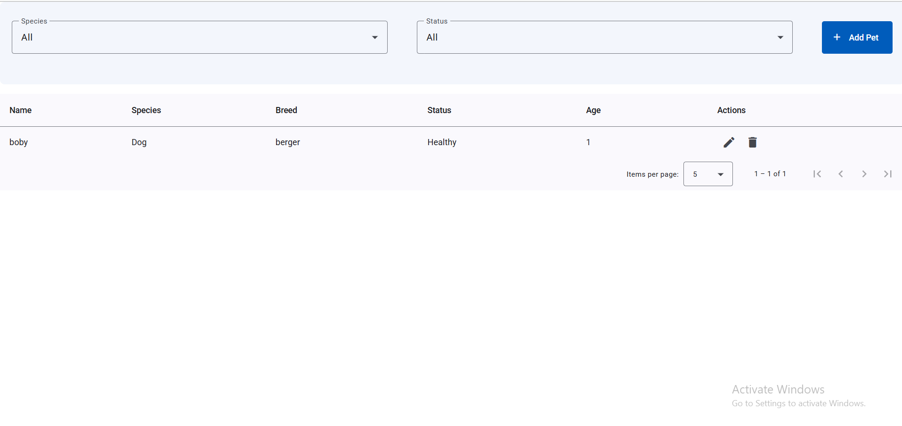
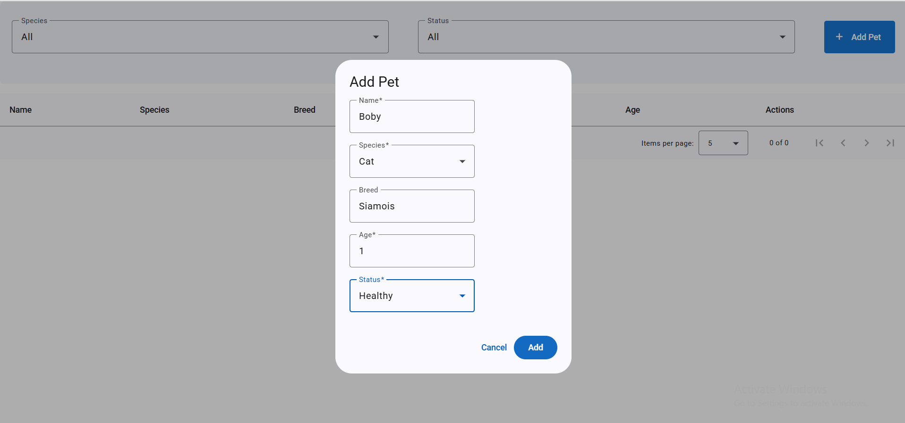
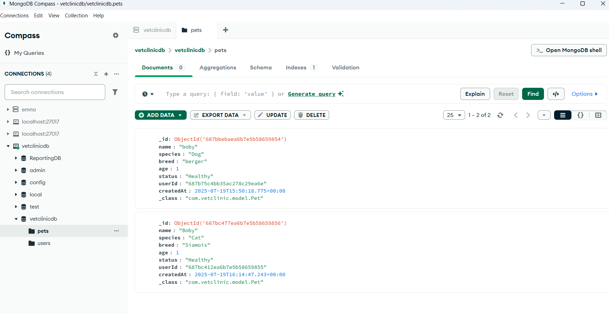

# 🐾 VetClinic – Pet Management App

A full-stack web application to manage pet data for a veterinary clinic. Built with **Angular** frontend, **Spring Boot** backend, and **MongoDB** for persistence.

---

## 📁 Folder Structure

/frontend # Angular v19.0.2 
/backend # Spring Boot API with MongoDB

---

## 🚀 Setup Instructions

### ✅ Prerequisites

- Node.js v20.15.0
- Angular CLI (`npm install -g @angular/cli`)
- Java v21
- Maven
- MongoDB (local)
- Docker & Docker Compose (for containerized deployment)

---

## ▶️ Running the App Locally

### 🖥️ Backend Setup

1. Navigate to backend:
   cd backend
Install dependencies and build:
mvn clean install
Run the application:

mvn spring-boot:run
The backend runs on:
http://localhost:8080

### 🌐 Frontend Setup
Navigate to frontend:
cd frontend
Install dependencies:
npm install

Run the Angular app:
ng serve

The frontend runs on:
http://localhost:4200

### ☁️ MongoDB Setup
Local MongoDB
Ensure MongoDB is running locally on:
mongodb://localhost:27017

Default database: vetclinic-db

Update the connection string in application.properties:
spring.data.mongodb.uri=mongodb://localhost:27017/vetclinicdb

📡 API Overview
🧪 Swagger UI
Accessible at:
http://localhost:8080/swagger-ui/index.html

Below are some demo screenshots of the VetClinic – Pet Management App:

### 📝 1. Register Page

---

### 🔐 2. Login Page

---

### 📋 3. Pet List Page

---

### ➕ 4. Add New Pet (Popup Form)

---

### 🗄️ 5. MongoDB Record for Registered Pet

🐳 Docker & Docker Compose (Optional)
Docker Compose
From project root:
docker-compose up --build

Access frontend: http://localhost:4200
Access backend: http://localhost:8080

👨‍💻 Author
Emna Haddar
GitHub Profile

📄 License
This project is licensed under the MIT License.

yaml
Copier
Modifier

---

Let me know if you'd like this adapted for deployment on Render, Heroku, Azure, etc.
