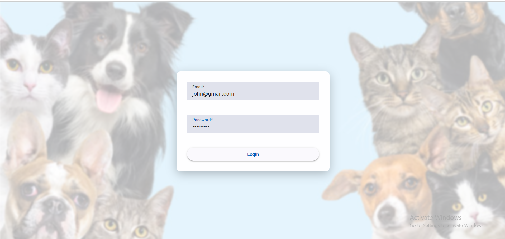

# 🐾 VetClinic – Pet Management App

A full-stack web application to manage pet data for a veterinary clinic.  
**Frontend:** Angular  
**Backend:** Spring Boot  
**Database:** MongoDB

---

## 📁 Folder Structure

```
/frontend   # Angular v19.0.2 (UI)
/backend    # Spring Boot API with MongoDB
```

---

## 🚀 Getting Started

### ✅ Prerequisites

- **Node.js** v20.15.0
- **Angular CLI**  
  Install globally:  
  ```bash
  npm install -g @angular/cli
  ```
- **Java** v21
- **Maven**
- **MongoDB** (local)
- **Docker & Docker Compose** (optional, for containers)

---

## ▶️ Running the App Locally

### 🖥️ Backend Setup

1. **Navigate to backend:**
   ```bash
   cd backend
   ```
2. **Install dependencies & build:**
   ```bash
   mvn clean install
   ```
3. **Run the application:**
   ```bash
   mvn spring-boot:run
   ```
   The backend will be available at:  
   [http://localhost:8080](http://localhost:8080)

---

### 🌐 Frontend Setup

1. **Navigate to frontend:**
   ```bash
   cd frontend
   ```
2. **Install dependencies:**
   ```bash
   npm install
   ```
3. **Run the Angular app:**
   ```bash
   ng serve
   ```
   The frontend will be available at:  
   [http://localhost:4200](http://localhost:4200)

---

### ☁️ MongoDB Setup

- Ensure MongoDB is running locally at:  
  `mongodb://localhost:27017`
- **Default database:** `vetclinic-db`
- **Update connection string** in `application.properties` if needed:
  ```
  spring.data.mongodb.uri=mongodb://localhost:27017/vetclinicdb
  ```

---

## 📡 API & Documentation

- **Swagger UI:**  
  [http://localhost:8080/swagger-ui/index.html](http://localhost:8080/swagger-ui/index.html)

---

## 🖼️ Demo Screenshots

### 📝 Register Page


---

### 🔐 Login Page


---

### 📋 Pet List Page


---

### ➕ Add New Pet (Popup Form)


---

### 🗄️ MongoDB Record for Registered Pet


---

## 🐳 Docker & Docker Compose (Optional)

To run everything with Docker Compose:

```bash
docker-compose up --build
```

- **Frontend:** [http://localhost:4200](http://localhost:4200)
- **Backend:** [http://localhost:8080](http://localhost:8080)

---

## 👨‍💻 Author

**Emna Haddar**  
[GitHub Profile](#) <!-- Add your GitHub profile link here -->

---

## 📄 License

This project is licensed under the **MIT License**.

---

